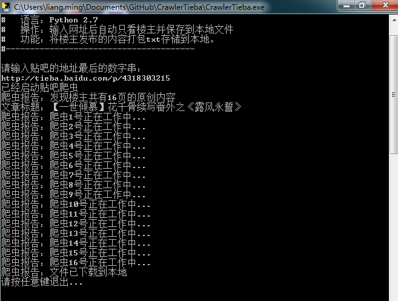
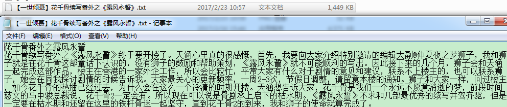

# CrawlerTieba

####项目内容：
用python写的一个简单的百度贴吧小说爬取程序
####使用方法：
双击运行
####原理解析：
首先，先浏览一下贴吧，找到一个小说，选择只看楼主：http://tieba.baidu.com/p/4318303215?see_lz=1&pn=1
多比较可以看出来，链接中p/后面4318303215代表ID，see_lz=1代表只看楼主，pn=1是第1页。
####效果展示：

